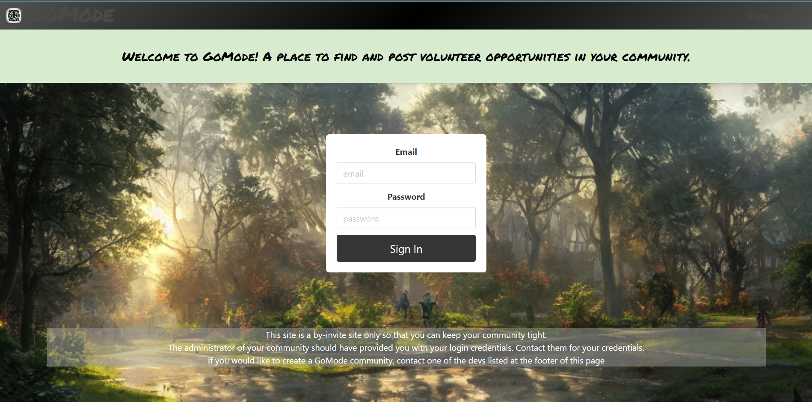
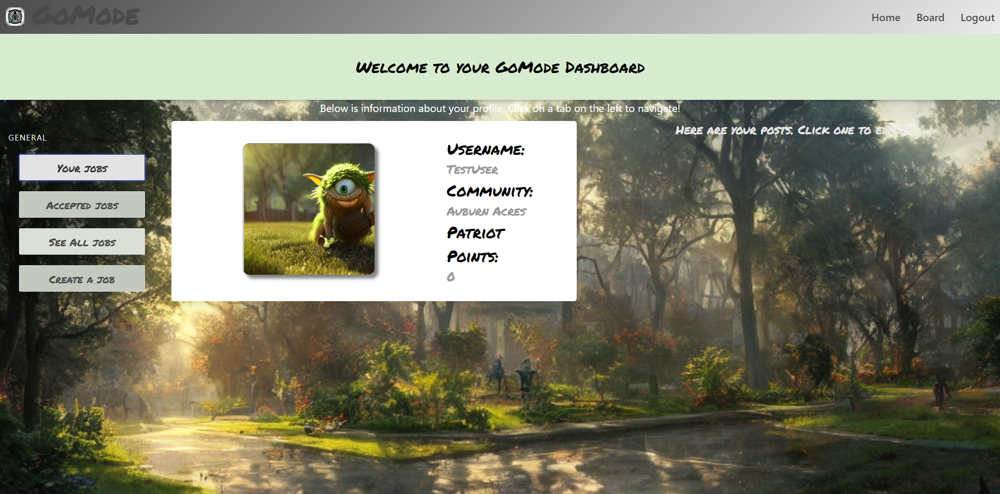
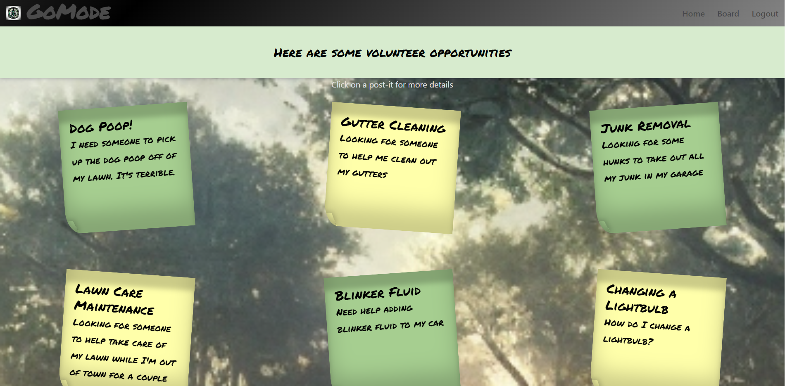

# GoMode  

## Description

---

Welcome to **GoMode**! 

Wanting to find a way to fill your spare time? Have you looked around your neighborhood and wondered what you could do to help out? Need a creative outlet for your skills and have already redone your bathroom twice? You've come to the right place!

GoMode, is a place to find, post, and take on volunteer opportunities in your community.

This site is a by-invite site only so that you can keep your community secure.
The administrator of your community should have provided you with your login credentials. Contact them for your credentials.
If you would like to create a GoMode community, contact one of the devs listed at the footer of this page

## Table of Contents

---

- [Installation](#installation)
- [Technology](#technology)
- [Demonstration](#demonstration)
- [Future Development](#future-development)
- [License](#license)
- [Authors](#authors)

## Installation

---

    - No installation required

## Technology

---

Technology used to build the application:

## Demonstration

---
<h3 align="center">
  Login Page
</h3>

<h3 align="center">
  Profile Page
</h3>

<h3 align="center">
  Job Page
</h3>

[Video Demonstration](https://drive.google.com/file/d/16HI1u05cHYHkJoR_A9UAjv4jV2gI2Y8Y/view)

Live application deployed to Heroku is available [here](https://gomodez.herokuapp.com/)

## Future Development

---

    - Updating and/or Deleting your account with associated posts
    - Having an Administrator Account
    - Giving reviews to the person who finished your job
    - Stripe

## License 

---
  MIT License

  ### About this License 

  Copyright 2022, Jacob Reeves, Patrick Sobczyk, Shep Sheperdigian, Shadin Al-Arab, Tony Tran

  Permission is hereby granted, free of charge, to any person obtaining a copy of this software and associated documentation files (the "Software"), to deal in the Software without restriction, including without limitation the rights to use, copy, modify, merge, publish, distribute, sublicense, and/or sell copies of the Software, and to permit persons to whom the Software is furnished to do so, subject to the following conditions:

  The above copyright notice and this permission notice shall be included in all copies or substantial portions of the Software.

  THE SOFTWARE IS PROVIDED "AS IS", WITHOUT WARRANTY OF ANY KIND, EXPRESS OR IMPLIED, INCLUDING BUT NOT LIMITED TO THE WARRANTIES OF MERCHANTABILITY, FITNESS FOR A PARTICULAR PURPOSE AND NONINFRINGEMENT. IN NO EVENT SHALL THE AUTHORS OR COPYRIGHT HOLDERS BE LIABLE FOR ANY CLAIM, DAMAGES OR OTHER LIABILITY, WHETHER IN AN ACTION OF CONTRACT, TORT OR OTHERWISE, ARISING FROM, OUT OF OR IN CONNECTION WITH THE SOFTWARE OR THE USE OR OTHER DEALINGS IN THE SOFTWARE.

  [Link to the MIT Webpage](https://www.mit.edu/~amini/LICENSE.md)

## Goblin Squad :japanese_goblin:

---

- Jacob Reeves :japanese_ogre:
  - [GitHub](https://github.com/JDReeves86)
- Patrick Sobczyk :japanese_ogre:
  - [GitHub](https://github.com/sobe1290)
- Shep Sheperdigian :japanese_ogre:
  - [GitHub](https://github.com/zshep)
- Shadin Al-Arab :japanese_ogre:
  - [GitHub](https://github.com/shadin-a)
- Tony Tran :japanese_ogre:
  - [GitHub](https://github.com/tonytran97)

